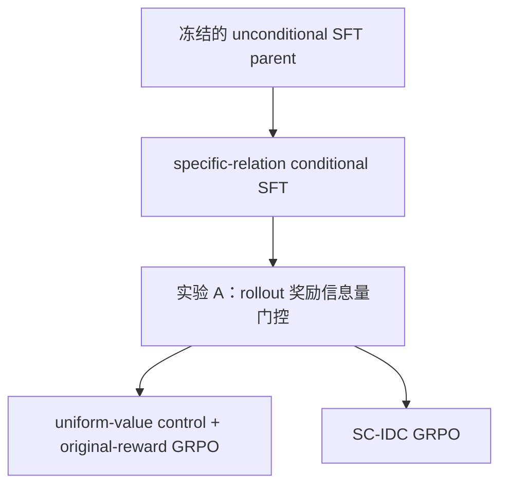

## 方案一（调整版）：控制值对齐的反事实指称贡献

英文暂名：**Semantic-Control Interventional Denotation Credit，SC-IDC**

### 1. 核心动机

SC-IDC 针对的基线将“满足控制条件”主要定义为：

- 生成指定的逻辑结构或元素数量；
- 指定实体/关系 token 出现在假设中。

但“条件出现”不等于“条件真正参与了解释”。模型可以将指定条件放入一个不影响最终结论的冗余分支，同时获得很高的语义相似度和条件遵循奖励。

SC-IDC 希望把语义控制从：

> 条件是否出现在假设里

提升为：

> 在保持结构和其他 token 不变时，这个条件是否位于有边际的解释分支中，并优于匹配替代值。

需要特别限定的是：**只重点奖励用户指定的 controlled semantic value，不要求所有实体和关系
槽位都不可替代。** 一个正确假设可以在当前 KG 上存在合理的外延冗余；SC-IDC 不把“每个
predicate 都不可删除”当作正确性的必要条件，也不声称 branch-supported selectivity 等同于
predicate necessity。

---

### 2. 将控制条件分为两类

#### 2.1 硬结构控制

包括：

- logic pattern；
- relation number；
- entity number。

这些条件可以被形式化验证，适合直接编译进 grammar/constrained decoding，使生成分布满足：

\[
\pi_\theta(H\notin\mathcal H(C)\mid O,C)=0.
\]

它们属于“合法假设空间”的定义，不必继续通过二元终局奖励学习。

#### 2.2 有效语义控制

包括：

- specific entity；
- specific relation。

首先保证指定 token 确实出现在合法逻辑位置，即 nominal adherence；然后分别审计它所在最近
逻辑分支的边际贡献，以及它相对匹配替代值的选择性。

因此：

- nominal adherence 负责“条件出现在合法位置”；
- SC-IDC 负责审计条件的 branch support 与 matched selectivity。

---

### 3. 可辨识的控制值采样与 occurrence 规则

specific relation prompt 暴露的是 relation 值 \(C\)，而不是 AST 中的 slot 地址。同一个值即使在
目标中出现多次，模型看到的条件仍然只是同一个 `COND C`；因此训练控制单位必须是 unique
relation value，不能把模型不可区分的重复 occurrence 当成不同监督。

对目标假设 \(H^\star\)，记 relation occurrence 集和 unique value 集为：

\[
Z_R(H^\star)=\{(\mathrm{path}_j,r_j)\}_{j=1}^{m},
\qquad
V_R(H^\star)=\mathrm{Unique}\{r_j\}_{j=1}^{m}.
\]

specific-relation SFT 的每个 epoch 按以下规则采样：

\[
C\sim\mathrm{Uniform}(V_R(H^\star)).
\]

训练条件可以由 `seed + record_id + epoch` 动态派生；validation、test、rollout signal set 和
正式 RL train 的 `(record_id, condition_kind, condition_value)` 必须提前物化、冻结并 hash。
两个 GRPO 分支共享完全相同的 RL condition manifest。

对生成假设 \(H\)，定义所有匹配 occurrence：

\[
\mathrm{Occ}(C,H)
=
\{\mathrm{path}_j:r_j=C\}.
\]

nominal adherence 只判断该集合是否非空。SC-IDC 奖励对全部 occurrence 做联合干预：一个
matched replacement 同时将所有 \(C\) occurrence 替换为同一个 \(C'\)；branch neutralization
则联合中性化这些 occurrence 所属、去重后的最近逻辑分支。逐 occurrence 结果仅用于 attribution，
不作为模型训练时彼此不可辨识的独立控制样本。

如果任务真的要求控制“第几个 slot”，就必须把 path/role 编码进 prompt；这属于新的控制任务，
不在本方案范围内。

---

### 4. 受控值的边际门控与匹配反事实

#### 4.1 matched replacement 不能单独识别装饰分支

原始设想只比较受控值和匹配替代值，但存在如下反例：

\[
H=H_0\lor B_C,\qquad [B_C]_G\subseteq[H_0]_G.
\]

此时包含 \(C\) 的分支对当前结论没有边际贡献，属于本方案希望识别的 control laundering。
然而，若某个匹配替代 \(C'\) 使 \(B_{C'}\) 引入额外假阳性，仍可能出现：

\[
R_{\mathrm{sem}}(H)-R_{\mathrm{sem}}(H_{C'})>0.
\]

正的 matched delta 因此只能说明“当前值优于这个替代值”，不能证明当前值所在分支不是
装饰。因此 SC-IDC 增加独立的逻辑分支边际门控。

#### 4.2 受控值所在最近逻辑分支的中性化边际

对于 \(\mathrm{Occ}(C,H)\) 中的每个 occurrence，沿逻辑树向上寻找最近的
intersection/union 分支祖先，将对应的直接子分支 path 去重后联合中性化：

- intersection 的恒等元为全集；
- union 的恒等元为空集；
- 去重后若一个待中性化 path 是另一个 path 的后代，只保留祖先 path，形成互不嵌套的
  ancestor-most antichain；
- 若任一受控 occurrence 不存在分支祖先，则加入 root marker，联合基线整体退化为空根查询。

记去重后的分支集合为 \(B_C\)，所得内部审计查询为 \(H^{(-B_C)}\)，定义：

\[
\Delta_C^{\mathrm{marg}}
=
R_{\mathrm{sem}}(H)-R_{\mathrm{sem}}(H^{(-B_C)}).
\]

这一量只衡量“包含受控值的最近分支集合”是否有边际贡献，不是 controlled predicate 本身的
删除效应。

#### 4.3 branch support 仍不等于 predicate necessity

即使 branch marginal 和 matched delta 都为正，controlled relation 本身仍可能冗余。例如：

\[
H=(A\land C)\lor D,
\qquad
[A\land C]_G=[A]_G.
\]

当 \(A\land C\) 整体分支对观测必不可少时，删除整个分支会得到正 branch marginal；若某个
\(C'\) 让该分支变差，matched delta 也可以为正。但删除 \(C\) 后 \(A\) 的外延不变，所以
这两个正 delta 仍不能证明 slot necessity 或单 predicate 因果必要性。

因此本方案只将两个正 delta 称为 **branch-supported selectivity**。只有未来能够在保持变量接口
和查询合法性的前提下严格定义 predicate neutralization 时，才额外报告 slot necessity；无法严格
定义的结构应标为不可识别。

#### 4.4 受控值的匹配替代优势

从匹配分布中选择替代值：

\[
C'\sim q_{\mathrm{match}}(r'\mid C,H,G),
\qquad
H^{(C')}=\operatorname{do}_{\mathrm{all}}(H,C\leftarrow C').
\]

在 WN18RR 上不虚构不存在的显式类型信息，而使用 observable graph 可推导的代理：

- relation：正/反方向、边频率区间、头尾实体的有向关系签名、反事实答案基数区间；
- entity：anchor 角色、相邻 projection 可达性、节点度数区间、有向 incident-relation 签名。

具体候选流程固定为：entity 先按派生 seed 确定性预筛最多 256 个，再按图特征保留 16 个；
entity/relation 都从综合排序最优的 8 个中按派生 seed 无放回采样 3 个。候选不足时按固定层级
放宽并记录 fallback，且始终排除原 token。

Phase 2 的 relation 训练 matcher 对每个 \(C\) 只建立一份静态排序：依次按方向 fallback 层级、
edge-frequency log-bin 距离、负的 head/tail endpoint-profile cosine、relation token id 排序。从最优
8 个中，以 `(reward_seed, record_id, canonical_query_hash, C)` 派生 seed，无放回选择 3 个。所有
occurrences 共享每次选出的同一个 \(C'\)，不允许为不同位置分别选择模型无法从 prompt 区分的
替代值。穷尽 fallback 后不足 3 个不同候选时，该 completion 记为 `unscorable`。

替换同时改变所有目标 occurrences，但保持 AST、logic pattern、occurrence 数量和其他 token
不变。matched intervention 用于衡量受控值的选择性，不单独承担“非装饰性”或 necessity 判定。

---

### 5. SC-IDC 双量审计与候选奖励

首先定义基础语义质量：

\[
R_{\mathrm{sem}}(H)=S([H]_G,O).
\]

离线核心固定 \(S\) 为 Jaccard。受控 relation value 的联合匹配替代优势为：

\[
\Delta_C^{\mathrm{match}}(H)
=
R_{\mathrm{sem}}(H)
-
\mathbb E_{C'\sim q_{\mathrm{match}}}
R_{\mathrm{sem}}(H^{(C')}).
\]

SC-IDC 同时保留两个判据：

\[
\mathrm{branch\_supported}
=
\mathbf 1[\Delta_C^{\mathrm{marg}}>\epsilon],
\qquad
\mathrm{matched\_selective}
=
\mathbf 1[\Delta_C^{\mathrm{match}}>\epsilon].
\]

据此区分：

- `branch_nonmarginal`：nominal 为 1，但 branch marginal 不为正；
- `branch_supported_nonselective`：branch marginal 为正，但未识别出正的 matched advantage；
- `branch_supported_selective`：branch marginal 与 matched advantage 均为正；
- `unscorable`：穷尽 fallback 后仍不足 3 个不同合法替代候选。

这四类只在 parse-ok 且 nominal 的 completion 内判定；parse-fail 与 nominal-fail 单独统计。
`unscorable` 具体指穷尽 fallback 后不足 3 个不同替代候选，仍可保留已经得到的 branch delta
作为诊断，但不计算 matched delta。

确定性图执行的主判定固定为 \(\epsilon=0\)，同时报告 \(\epsilon=0.01/0.05\) 的敏感性；归一化
诊断固定使用 \(\tau_{\mathrm{marg}}=\tau_{\mathrm{match}}=0.1\)。

后续若进入训练，可审计如下候选奖励：

\[
R_{\mathrm{BSS}}(H,C)
=
\mathbf 1[\mathrm{Occ}(C,H)\ne\varnothing]\,
w(R_{\mathrm{sem}}(H))\,
\operatorname{clip}
\left(
\frac{\Delta_C^{\mathrm{marg}}(H)-\epsilon}{\tau_{\mathrm{marg}}},
0,1
\right)
\operatorname{clip}
\left(
\frac{\Delta_C^{\mathrm{match}}(H)-\epsilon}{\tau_{\mathrm{match}}},
0,1
\right).
\]

Experiment A 固定取 \(w(R_{\mathrm{sem}})=R_{\mathrm{sem}}\)，并将其作为语义奖励的受控 relation-value
附加项。这里不对 occurrence 或全部槽位求和。该分数只编码 branch-supported selectivity，
不能命名为 slot necessity 或严格因果效应；新增奖励系数 \(\alpha_{\mathrm{IDC}}\) 由实验 A 的
预注册规则冻结。该符号与现有 GRPO 的 KL 系数 \(\beta_{\mathrm{KL}}\) 严格区分。

---

### 6. 非受控槽位如何使用 IDC

对于不属于 \(\mathrm{Occ}(C,H)\) 的其他槽位 \(z\)，仍然可以计算：

\[
\Delta_z
=
R_{\mathrm{sem}}(H)
-
\mathbb E_{z'}R_{\mathrm{sem}}(H_{z\leftarrow z'}).
\]

但它们主要用于：

- 解释每个 relation/entity 的作用；
- 识别 dead branch；
- 诊断冗余或有害谓词；
- 分析不同 operator 的 precision/recall 贡献；
- 构造后续的 hard-negative preference pairs。

不建议优化：

\[
\sum_{z\in H}[\Delta_z]_+,
\]

因为这会偏向“所有 predicate 都必须外延不可替代”的假设。

如果确实希望加入全局正则，更安全的是只弱惩罚明显有害的组件：

\[
R_{\mathrm{harm}}
=
-\lambda_{\mathrm{harm}}
\frac1{|Z(H)|}
\sum_{z\in Z(H)}
\max(0,-\Delta_z),
\qquad
\lambda_{\mathrm{harm}}\ll\alpha_{\mathrm{IDC}}.
\]

这样：

- \(\Delta_z>0\)：有益，但不额外强迫其变得更大；
- \(\Delta_z=0\)：允许合理冗余；
- \(\Delta_z<0\)：说明替换该槽位反而能改善解释，给予轻微惩罚。

第一轮实验甚至可以完全不使用 \(R_{\mathrm{harm}}\)，只把非受控 IDC 作为诊断指标。

---

### 7. Nominal、Branch Support 与 Selectivity 分开评估

SC-IDC 不取代 nominal adherence，也不把 branch support 误称为 predicate necessity。建议同时报告：

1. **Nominal Adherence**

\[
\mathrm{Acc}_{\mathrm{nom}}
=
\Pr(C\text{ 出现在合法位置}).
\]

2. **Branch-Supported Rate**

\[
\mathrm{Acc}_{\mathrm{branch}}
=
\Pr(\Delta_C^{\mathrm{marg}}>\epsilon).
\]

3. **Matched Selectivity**

\[
\mathrm{Acc}_{\mathrm{match}}
=
\Pr(\Delta_C^{\mathrm{match}}>\epsilon).
\]

4. **Branch-Supported Selectivity**

\[
\Pr(
\Delta_C^{\mathrm{marg}}>\epsilon
\land
\Delta_C^{\mathrm{match}}>\epsilon
).
\]

5. **Branch-Nonmarginal Rate**

\[
\Pr(
\mathrm{nominal}=1
\land
\Delta_C^{\mathrm{marg}}\le\epsilon
).
\]

第五项只衡量“条件虽然出现，但其最近逻辑分支集合没有正边际”。在自然 reference/model
outputs 上不能直接把这一比例命名为 laundering，因为图冗余不等于模型有意规避控制。

6. **Labeled Laundering Detection**

只在人工构造、已知受控分支被其他 OR 分支遮蔽的对抗集上报告 detection rate。该指标验证
branch gate 能否发现已知 laundering，不把 gold reference 的自然冗余反向解释成 laundering。

需要明确：任一 delta 为 0 都不代表假设错误；两个 delta 均为正也不证明 predicate necessity。
nominal、branch support、matched selectivity 和 slot necessity 是不同层级的命题。

---

### 8. 最小验证实验

最小验证不训练，先使用合成对抗集与 fresh RL reference queries 审计机制本身。reference
queries 的 nominal adherence 天然为 1，因此不能用于模型级 semantic-control 结论。

模型级主实验只选择 `specific_relation`，不要求重新复现其余四种 controls。SC-IDC 的逻辑核心
仍保持 entity/relation 通用，但训练结论明确限定为 relation control。训练与对照主线为：

#### Phase 2 启动前的身份与数据契约

不得通过放宽通用 hash 校验来复用旧资产，而应新增两个显式、可审计的导入契约：

1. **import-unconditional-parent**

   允许新 specific-relation config 跨 condition 导入冻结的 unconditional 权重，但必须验证
   source stage、source config hash、data/KG hash、model architecture、tokenizer identity 和
   checkpoint SHA；新 conditional SFT 重置 optimizer/scheduler，并记录 source/target config hash。

2. **condition-agnostic fresh-query rebind**

   导入旧 fresh-query artifact 时验证原 artifact SHA、sampling manifest、data/KG identity、
   record IDs、query/supervision 去重与 split 排除契约；随后生成新的 target config hash 和
   relation condition manifests，同时保留 source config hash。旧 manifest 本身不被改写。

specific-relation conditional SFT 使用独立 config hash 和 checkpoint lineage，不覆盖原复现
checkpoint。train condition 按 epoch 从 unique relation values 动态派生；validation、test、
rollout signal 与 RL train conditions 固定并 hash 化。test condition manifest 由隔离的
split-preparation 步骤生成并封存，训练、signal gate 和 checkpoint 选择均不得加载。conditional
SFT 完成后冻结为两个 GRPO 分支的共同 parent。

#### 实验 A：奖励信息量

先物化一份 train-graph-only signal set，使其与 conditional SFT train、正式 RL train、
validation 和 test 的 query/supervision identity 均不重合。在冻结的 specific-relation
conditional SFT parent 上生成 rollout，并对同一批 completions 同时计算：

\[
R_{\mathrm{base}}
=
R_{J}+0.5R_{D}+0.5R_{O}+R_{\mathrm{nom}},
\qquad
R_{\mathrm{aug}}
=
R_{\mathrm{base}}+\alpha_{\mathrm{IDC}}R_{\mathrm{BSS}}.
\]

其中 \(R_{\mathrm{BSS}}\) 使用全部 \(C\) occurrences 的联合干预，固定
\(\tau_{\mathrm{marg}}=\tau_{\mathrm{match}}=0.1\) 且 \(w(R_{\mathrm{sem}})=R_{\mathrm{sem}}\)。
现有 GRPO KL 系数保持 \(\beta_{\mathrm{KL}}=0.1\)，两条分支完全相同。parse-fail、nominal-fail 或
unscorable completion 的 SC-IDC 附加项为 0，基础 reward 仍按原规则计算，不为其另造负奖励。

signal set 固定按 13 个 pattern 各 16 个 prompt 分层抽样，共 208 个 rollout groups；每组使用与
正式 GRPO 相同的 4 个 generations，共审计 832 个 completions。抽样 manifest 在 rollout 前冻结。

比较：

- zero-reward-variance group rate；
- 非相同 completion 的 reward-tie rate；
- unique denotation 数量；
- nominal relation adherence 和 SC-IDC 可评分率；
- semantic ranking inversion rate；
- 每次 rollout 的额外执行成本。

reward-tie rate 在同一 prompt 内所有“字符串不同且均可评分”的无序 completion pairs 上计算。
相对降幅定义为 \((T_{\mathrm{base}}-T_{\mathrm{aug}})/T_{\mathrm{base}}\)；若
\(T_{\mathrm{base}}=0\)，则没有可证实的额外解平局空间，signal gate 失败。ranking inversion
只在同一 prompt、两条 completion 均 nominal/scorable 且基础语义分数不等
的 pair 上计算，表示 augmented reward 是否反向排序了原本更高的语义质量。

为控制训练成本，训练版 matcher 与离线审计版分开冻结：先仅用方向、频率和关系签名等静态
特征选出最终 \(K=3\)，再执行这 3 个 replacements；替换后的答案基数只作事后诊断，不参与
预筛排序。base denotation 在基础语义 reward 与 SC-IDC 间共享，neutral/replacement denotation
按 query hash 缓存。每个 scorable completion 最多 5 次图执行，即 1 次共享 base、1 次 joint
neutralization 和 3 次 joint replacements；SC-IDC 增量上限为 4 次。

在运行 signal set 之前预注册
\(\alpha_{\mathrm{IDC}}\in\{0.25,0.5,1.0\}\)，并选择满足全部条件的最小值：

- parse-ok \(\ge 0.90\)，EOS rate \(\ge 0.98\)；
- nominal adherence \(\ge 0.80\)；
- nominal completions 中 scorable rate \(\ge 0.95\)；
- 208 个 rollout groups 中至少 104 个含有两条非相同、可评分 completion；
- 相对 baseline 的非相同 completion reward-tie rate 至少下降 10%；
- semantic ranking inversion rate \(\le 5\%\)；
- 实测 p95 reward wall-time 不超过单次 base semantic execution 的 6 倍；
- 相同 seed 的 rollout identity、reward rows 和 summary hash 可复现。

一旦选中 \(\alpha_{\mathrm{IDC}}\)，将 signal-set hash、候选表、选择结果和最终 reward contract
写入冻结 manifest，之后不得根据 validation/test 调参。若没有候选 \(\alpha_{\mathrm{IDC}}\)
通过，实验 A 失败并停止，
先修复 conditional SFT、condition manifest 或 reward 计算，不直接启动 GRPO。

#### 实验 B：OR-append 对抗集（硬门槛）

从一个已经很好解释 \(O\) 的假设开始，添加一个包含指定条件 \(C\)、但被其他 OR 分支完全遮蔽的分支。

预期：

- nominal adherence 仍为 1；
- 原 condition reward 仍为 1；
- matched delta 可能为 0，也可能因替代项引入假阳性而大于 0；
- \(\Delta_C^{\mathrm{marg}}=0\)；
- 判为 `branch_nonmarginal`，并在这个有标签对抗集上计为 laundering detection 成功。

如果边际门控无法识别这类案例，方案的核心动机就不成立。该实验必须显式包含“matched
delta 为正但分支仍冗余”的反例，防止实现退回 matched-only 判定。

#### 实验 B1：嵌套 predicate 冗余反例（硬门槛）

显式构造：

\[
H=(A\land C)\lor D,
\qquad
[A\land C]_G=[A]_G,
\]

并令 \(A\land C\) 整体分支对观测必不可少、某个 \(C'\) 替换会降低语义质量。预期 branch
marginal 与 matched delta 均为正，分类只能是 `branch_supported_selective`；测试必须同时断言
系统没有输出 slot necessity 或 predicate-causal claim。该反例防止实现把 branch support 偷换为
controlled predicate 本身不可删除。

#### 实验 B2：真实 KG reference 审计

在 train graph 的 fresh RL-only reference queries 上，按 pattern 分层抽样，同时枚举所有
entity/relation occurrences，并在每种条件内赋予 \(1/m\) attribution 权重。该 occurrence-level
审计不定义 Phase 2 的 prompt 采样单位；硬验收只检查：

- 新旧执行器等价；
- reference denotation 与 observation 完全一致；
- matched replacement 保持结构和槽位数；
- slot 权重契约和确定性产物成立；
- fallback 后不存在完全不可评分的 slot。

真实 branch-supported selectivity 与 branch-nonmarginal 比例只作诊断，不预设“必须有利”的
结果门槛，也不把 gold reference 的 branch-nonmarginal 比例命名为 laundering。

#### 实验 C：槽位位置泛化

prompt 不包含 slot 地址，因此不能把 first/non-first occurrence 当成不同控制条件。位置分析按
condition value 在目标/生成假设中的 occurrence topology 分组：

- 只出现在第一个 relation slot；
- 只出现在 non-first relation slots；
- 在多个位置重复出现。

所有训练和评测 prompt 仍按 unique relation values 采样。该分析检查 fixed-first 历史策略留下的
位置捷径，但不向模型提供它无法观察的 oracle path。

#### 实验 D：specific-relation GRPO 主对照

实验 A 通过后，从同一个冻结的 specific-relation conditional SFT parent 分叉：

- **uniform-value control + original-reward baseline**：保持原 Jaccard/Dice/Overlap 与
  nominal condition reward；
- **SC-IDC GRPO**：在完全相同的基础 reward 上加入 controlled-relation SC-IDC 项。

两条分支必须共享同一份物化 RL prompt/condition manifest、初始化权重、generation 参数、
optimizer 和 seed，唯一方法差异是 SC-IDC 奖励。由于 SC-IDC 有额外图执行成本，不能同时声称
“相同步数”和“相同执行预算”：

- **update-matched 主结果**：比较相同 optimizer updates，完整报告 SC-IDC 的额外执行数和时间；
- **graph-execution-matched 辅助结果**：分别按累计图执行数对齐最近的不超预算 checkpoint；
- **wall-time-matched 辅助结果**：分别按累计 wall-time 对齐最近的不超预算 checkpoint。

图执行数和 wall-time 是两个独立的 compute 轴，不声称两者能够同时精确匹配。训练过程按 update、
累计图执行数和 wall-time 高频保存审计点，使同一对运行可形成三种视图。
比较 nominal adherence、branch-supported rate、matched selectivity、branch-supported
selectivity、branch-nonmarginal rate、语义质量、parse/EOS 和复杂度分布。已知 laundering 只在
有标签对抗集上报告 detection。

entity control、all-slot IDC 和其他 structural controls 不进入主训练对照；因此模型级结论只覆盖
specific relation，不能外推成 entity control 已被训练验证。

该 baseline 不能称为“原始 CtrlHGen baseline”：它已经采用 uniform unique-value condition，
而原实现是 fixed-first condition。准确名称必须保留为
`uniform-value control + original-reward baseline`。

---

### 9. 主要风险

- 匹配替代分布若不合理，\(\Delta_C^{\mathrm{match}}\) 可能只反映 degree 或稀有度差异。
- branch marginal 归因于最近逻辑分支，不等同于严格的单 predicate 因果贡献。
- 一个必要分支内部仍可能包含冗余 controlled predicate，因此两个正 delta 也不证明 slot necessity。
- 同义或外延等价关系可能让一个合理控制条件得到 \(\Delta_C^{\mathrm{match}}\approx0\)。
- 当前有限 KG 上的冗余不代表完整图上的冗余。
- 多次反事实执行会增加训练成本，需要缓存或限制替代样本数。
- 离线 audit matcher 与 compute-bounded training matcher 的候选分布不同，必须分别冻结并报告。
- effective control 是比论文 lexical control 更强的任务定义，因此必须同时报告 nominal adherence，不能悄悄替换原评价口径。
- 当用户给出多个 semantic values 时，应显式定义 value-level 联合干预，仍然不扩展到全部槽位。

### 最终概括

SC-IDC 的核心不是追求一个“逐 predicate 最小”的假设，而是：

> 保留合理的逻辑冗余，但要求用户明确指定的语义值不仅出现在假设中，而且位于有边际的解释
> 分支中，并相对匹配替代值表现出可审计的选择性。

SC-IDC 把“受控值所在分支集合是否有正边际”和“当前受控值是否优于匹配替代”分开报告。
两者同时成立时称为 branch-supported selective，而不是 strict effective 或 predicate-necessary。
这比原始二元 condition reward 提供更细的控制诊断，同时避免 matched-only 反例，也不会把
整个 abductive objective 偷换成过强的逻辑最小化目标。
