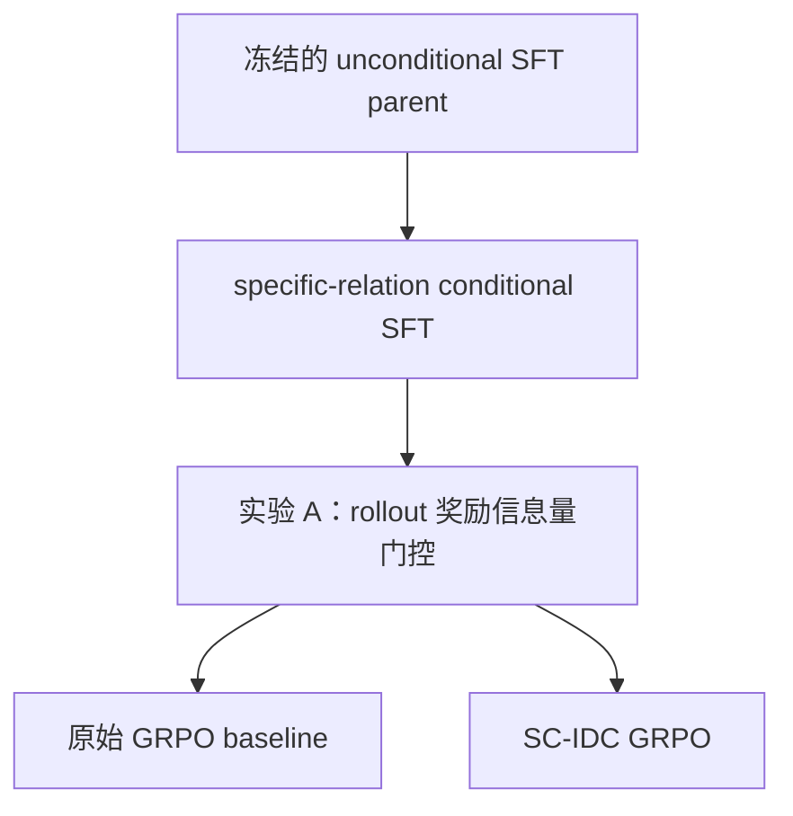

## 方案一（调整版）：槽位对称的受控反事实指称贡献

英文暂名：**Slot-Symmetric Controlled Interventional Denotation Credit，SC-IDC**

### 1. 核心动机

SC-IDC 针对的基线将“满足控制条件”主要定义为：

- 生成指定的逻辑结构或元素数量；
- 指定实体/关系 token 出现在假设中。

但“条件出现”不等于“条件真正参与了解释”。模型可以将指定条件放入一个不影响最终结论的冗余分支，同时获得很高的语义相似度和条件遵循奖励。

SC-IDC 希望把语义控制从：

> 条件是否出现在假设里

提升为：

> 在保持其他因素基本不变时，这个条件是否对假设的结论产生了实际且有益的影响。

需要特别限定的是：**只重点奖励用户指定的 controlled slot，不要求所有实体和关系槽位都不可替代。** 一个正确假设可以在当前 KG 上存在合理的外延冗余；SC-IDC 不把“每个 predicate 都不可删除”当作正确性的必要条件。

---

### 2. 将控制条件分为两类

#### 2.1 硬结构控制

包括：

- logic pattern；
- relation number；
- entity number。

这些条件可以被形式化验证，适合直接编译进 grammar/constrained decoding，使生成分布满足：

\[
\pi_\theta(H\notin\mathcal H(C)\mid O,C)=0.
\]

它们属于“合法假设空间”的定义，不必继续通过二元终局奖励学习。

#### 2.2 有效语义控制

包括：

- specific entity；
- specific relation。

首先保证指定 token 确实出现在合法逻辑位置，即 nominal adherence；然后通过反事实干预判断它是否真正影响假设结论，即 effective adherence。

因此：

- nominal adherence 负责“条件被使用”；
- SC-IDC 负责“条件不是装饰性的”。

---

### 3. 槽位对称的控制条件采样

论文描述的是从目标假设中随机采样一个实体或关系；若实现固定选择序列中的第一个合法元素，
会造成明显的位置捷径。

调整后，对于目标假设 \(H^\star\) 的所有 eligible slots：

\[
Z(H^\star)=\{z_1,\ldots,z_m\},
\]

每个 epoch 均匀采样：

\[
z_C\sim\mathrm{Uniform}(Z(H^\star)).
\]

如果离线枚举全部控制条件，则每个条件样本赋予 \(1/m\) 权重，避免长假设因为槽位更多而被过度采样。

目标假设仍采用 canonical serialization，不需要依靠随机交换逻辑分支来制造表面多样性。

---

### 4. 受控槽位的边际门控与匹配反事实

#### 4.1 matched replacement 不能单独识别装饰分支

原始设想只比较受控值和匹配替代值，但存在如下反例：

\[
H=H_0\lor B_C,\qquad [B_C]_G\subseteq[H_0]_G.
\]

此时包含 \(C\) 的分支对当前结论没有边际贡献，属于本方案希望识别的 control laundering。
然而，若某个匹配替代 \(C'\) 使 \(B_{C'}\) 引入额外假阳性，仍可能出现：

\[
R_{\mathrm{sem}}(H)-R_{\mathrm{sem}}(H_{C'})>0.
\]

正的 matched delta 因此只能说明“当前值优于这个替代值”，不能证明当前值所在分支不是
装饰。因此 SC-IDC 增加独立的逻辑分支边际门控。

#### 4.2 最近逻辑分支的中性化边际

对于受控 slot，沿逻辑树向上寻找最近的 intersection/union 分支祖先，并用对应的逻辑恒等元
替代包含该 slot 的直接子分支：

- intersection 的恒等元为全集；
- union 的恒等元为空集；
- 若不存在分支祖先，则用空根查询表示移除唯一解释链。

记所得内部审计查询为 \(H^{(-B_C)}\)，定义：

\[
\Delta_C^{\mathrm{marg}}
=
R_{\mathrm{sem}}(H)-R_{\mathrm{sem}}(H^{(-B_C)}).
\]

这一量衡量最近逻辑分支的边际贡献，不应被表述成严格的单 predicate 因果效应。

#### 4.3 受控值的匹配替代优势

从匹配分布中选择替代值：

\[
z_C'\sim q_{\mathrm{match}}(z'\mid z_C,H,G),
\qquad
H^{(C')}=\operatorname{do}(H,z_C\leftarrow z_C').
\]

在 WN18RR 上不虚构不存在的显式类型信息，而使用 observable graph 可推导的代理：

- relation：正/反方向、边频率区间、头尾实体的有向关系签名、反事实答案基数区间；
- entity：anchor 角色、相邻 projection 可达性、节点度数区间、有向 incident-relation 签名。

具体候选流程固定为：entity 先按派生 seed 确定性预筛最多 256 个，再按图特征保留 16 个；
entity/relation 都从综合排序最优的 8 个中按派生 seed 无放回采样 3 个。候选不足时按固定层级
放宽并记录 fallback，且始终排除原 token。

替换只改变目标 slot，保持 AST、logic pattern 和 entity/relation 数量不变。matched
intervention 用于衡量受控值的选择性，不再单独承担“非装饰性”判定。

---

### 5. SC-IDC 双量审计与候选奖励

首先定义基础语义质量：

\[
R_{\mathrm{sem}}(H)=S([H]_G,O).
\]

离线核心固定 \(S\) 为 Jaccard。受控 slot 的匹配替代优势为：

\[
\Delta_C^{\mathrm{match}}(H)
=
R_{\mathrm{sem}}(H)
-
\mathbb E_{z_C'\sim q_{\mathrm{match}}}
R_{\mathrm{sem}}(H^{(C')}).
\]

SC-IDC 同时保留两个判据：

\[
\mathrm{marginal\_effective}
=
\mathbf 1[\Delta_C^{\mathrm{marg}}>\epsilon],
\qquad
\mathrm{matched\_selective}
=
\mathbf 1[\Delta_C^{\mathrm{match}}>\epsilon].
\]

据此区分：

- `laundered`：nominal 为 1，但 branch marginal 不为正；
- `marginal_only`：branch marginal 为正，但未识别出正的 matched advantage；
- `strict_effective`：两者均为正；
- `unscorable`：没有合法替代候选。

确定性图执行的主判定固定为 \(\epsilon=0\)，同时报告 \(\epsilon=0.01/0.05\) 的敏感性；归一化
诊断分数固定使用 \(\tau=0.1\)。

后续若进入训练，可审计如下候选奖励：

\[
R_{\mathrm{eff}}(H,C)
=
\mathbf 1[C\in H]\,
w(R_{\mathrm{sem}}(H))\,
\operatorname{clip}
\left(
\frac{\Delta_C^{\mathrm{marg}}(H)-\epsilon}{\tau_{\mathrm{marg}}},
0,1
\right)
\operatorname{clip}
\left(
\frac{\Delta_C^{\mathrm{match}}(H)-\epsilon}{\tau_{\mathrm{match}}},
0,1
\right).
\]

仍可取 \(w(R_{\mathrm{sem}})=R_{\mathrm{sem}}\)，并将其作为语义奖励的受控槽位附加项。
这里不对所有槽位求和。离线审计只输出原始 delta、阈值敏感性和候选诊断分数，不直接定义
GRPO 训练权重。

---

### 6. 非受控槽位如何使用 IDC

对于其他槽位 \(z\neq z_C\)，仍然可以计算：

\[
\Delta_z
=
R_{\mathrm{sem}}(H)
-
\mathbb E_{z'}R_{\mathrm{sem}}(H_{z\leftarrow z'}).
\]

但它们主要用于：

- 解释每个 relation/entity 的作用；
- 识别 dead branch；
- 诊断冗余或有害谓词；
- 分析不同 operator 的 precision/recall 贡献；
- 构造后续的 hard-negative preference pairs。

不建议优化：

\[
\sum_{z\in H}[\Delta_z]_+,
\]

因为这会偏向“所有 predicate 都必须外延不可替代”的假设。

如果确实希望加入全局正则，更安全的是只弱惩罚明显有害的组件：

\[
R_{\mathrm{harm}}
=
-\lambda
\frac1{|Z(H)|}
\sum_{z\in Z(H)}
\max(0,-\Delta_z),
\qquad
\lambda\ll\beta.
\]

这样：

- \(\Delta_z>0\)：有益，但不额外强迫其变得更大；
- \(\Delta_z=0\)：允许合理冗余；
- \(\Delta_z<0\)：说明替换该槽位反而能改善解释，给予轻微惩罚。

第一轮实验甚至可以完全不使用 \(R_{\mathrm{harm}}\)，只把非受控 IDC 作为诊断指标。

---

### 7. Nominal、Marginal 与 Strict Effective 分开评估

SC-IDC 不应完全取代原来的条件遵循指标，而应增加一个更严格的维度。

建议同时报告：

1. **Nominal Adherence**

\[
\mathrm{Acc}_{\mathrm{nom}}
=
\Pr(C\text{ 出现在合法位置}).
\]

2. **Marginal Effective Adherence**

\[
\mathrm{Acc}_{\mathrm{eff}}
=
\Pr(\Delta_C^{\mathrm{marg}}>\epsilon).
\]

3. **Matched Selectivity**

\[
\mathrm{Acc}_{\mathrm{match}}
=
\Pr(\Delta_C^{\mathrm{match}}>\epsilon).
\]

4. **Strict Effective Adherence**

\[
\Pr(
\Delta_C^{\mathrm{marg}}>\epsilon
\land
\Delta_C^{\mathrm{match}}>\epsilon
).
\]

5. **Control Laundering Rate**

\[
\Pr(
\mathrm{nominal}=1
\land
\Delta_C^{\mathrm{marg}}\le\epsilon
).
\]

第五项专门衡量“条件虽然出现，但其最近逻辑分支对当前解释没有正边际”的比例。

需要明确：任一 delta 为 0 都不代表假设错误。它只表示相应贡献在当前 KG 和干预定义下不可
识别。因此 nominal、marginal 和 matched 三种指标不能互相替代。

---

### 8. 最小验证实验

最小验证不训练，先使用合成对抗集与 fresh RL reference queries 审计机制本身。reference
queries 的 nominal adherence 天然为 1，因此不能用于模型级 semantic-control 结论。

模型级主实验只选择 `specific_relation`，不要求重新复现其余四种 controls。SC-IDC 的逻辑核心
仍保持 entity/relation 通用，但训练结论明确限定为 relation control。训练与对照主线为：

unconditional parent 只复用权重，不重新训练；specific-relation conditional SFT 使用独立配置、
config hash 和 checkpoint lineage，并显式记录 imported-parent SHA，不覆盖原复现 checkpoint。
conditional SFT 完成后冻结为两个 GRPO 分支的共同 parent。

#### 实验 A：奖励信息量

在冻结的 specific-relation conditional SFT parent 上生成 rollout，并对同一批 completions 同时
计算原 reward 与加入 SC-IDC 后的 reward，比较：

- zero-reward-variance group rate；
- 不同字符串但相同 reward 的比例；
- unique denotation 数量；
- nominal relation adherence 和 SC-IDC 可评分率；
- 每次 rollout 的额外执行成本。

实验 A 只决定奖励是否提供了可学习的额外区分信号，不更新模型。SC-IDC 主要应该减少
“不同假设、相同终局集合奖励”的 tie，无法解决四条 completion 完全相同的情况；若 nominal
adherence 或可评分组不足，应先修复 conditional SFT/rollout，而不是直接启动 GRPO。

#### 实验 B：OR-append 对抗集（硬门槛）

从一个已经很好解释 \(O\) 的假设开始，添加一个包含指定条件 \(C\)、但被其他 OR 分支完全遮蔽的分支。

预期：

- nominal adherence 仍为 1；
- 原 condition reward 仍为 1；
- matched delta 可能为 0，也可能因替代项引入假阳性而大于 0；
- \(\Delta_C^{\mathrm{marg}}=0\)；
- effective adherence 判为失败。

如果边际门控无法识别这类案例，方案的核心动机就不成立。该实验必须显式包含“matched
delta 为正但分支仍冗余”的反例，防止实现退回 matched-only 判定。

#### 实验 B2：真实 KG reference 审计

在 train graph 的 fresh RL-only reference queries 上，按 pattern 分层抽样，同时枚举所有
entity/relation slots，并在每种条件内赋予 \(1/m\) 权重。硬验收只检查：

- 新旧执行器等价；
- reference denotation 与 observation 完全一致；
- matched replacement 保持结构和槽位数；
- slot 权重契约和确定性产物成立；
- fallback 后不存在完全不可评分的 slot。

真实 effective/laundering 比例只作诊断，不预设“必须有利”的结果门槛。

#### 实验 C：槽位位置泛化

在 relation slots 内分别用：

- first slot；
- non-first slot；
- 全部槽位均匀采样

作为 semantic control，检查模型是否存在明显 first-slot advantage，以及均匀训练后差距是否缩小。

#### 实验 D：specific-relation GRPO 主对照

实验 A 通过后，从同一个冻结的 specific-relation conditional SFT parent 分叉：

- **原始 GRPO baseline**：保持原 Jaccard/Dice/Overlap 与 nominal condition reward；
- **SC-IDC GRPO**：在完全相同的基础 reward 上加入 controlled-relation SC-IDC 项。

两条分支必须共享 RL-only 数据、prompt/slot 采样、初始化权重、generation 参数、optimizer、seed、
训练步数和图执行预算，唯一方法差异是 SC-IDC 奖励。比较 nominal adherence、marginal effective、
matched selectivity、strict effective、laundering、语义质量、parse/EOS 和复杂度分布。

entity control、all-slot IDC 和其他 structural controls 不进入主训练对照；因此模型级结论只覆盖
specific relation，不能外推成 entity control 已被训练验证。

---

### 9. 主要风险

- 匹配替代分布若不合理，\(\Delta_C^{\mathrm{match}}\) 可能只反映 degree 或稀有度差异。
- branch marginal 归因于最近逻辑分支，不等同于严格的单 predicate 因果贡献。
- 同义或外延等价关系可能让一个合理控制条件得到 \(\Delta_C^{\mathrm{match}}\approx0\)。
- 当前有限 KG 上的冗余不代表完整图上的冗余。
- 多次反事实执行会增加训练成本，需要缓存或限制替代样本数。
- effective control 是比论文 lexical control 更强的任务定义，因此必须同时报告 nominal adherence，不能悄悄替换原评价口径。
- 当用户给出多个 semantic controls 时，应只对这些 controlled slots 计算联合或逐控制 IDC，仍然不扩展到全部槽位。

### 最终概括

SC-IDC 的核心不是追求一个“逐 predicate 最小”的假设，而是：

> 保留合理的逻辑冗余，但要求用户明确指定的语义条件不仅出现在假设中，而且对该假设解释观测的方式产生可验证的实际影响。

SC-IDC 把“原分支是否有正边际”和“当前受控值是否优于匹配替代”分开报告。只有两者同时
成立时才称为 strict effective；这比原始二元 condition reward 更接近“有效可控”，同时避免
matched-only 反例，也不会把整个 abductive objective 偷换成过强的逻辑最小化目标。
