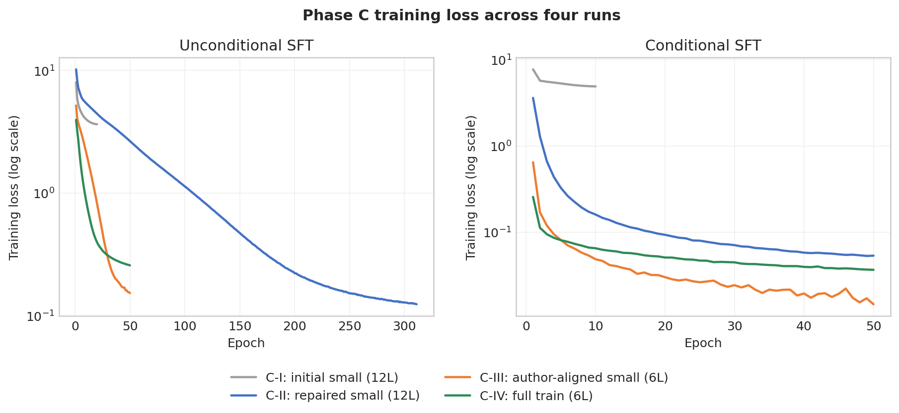
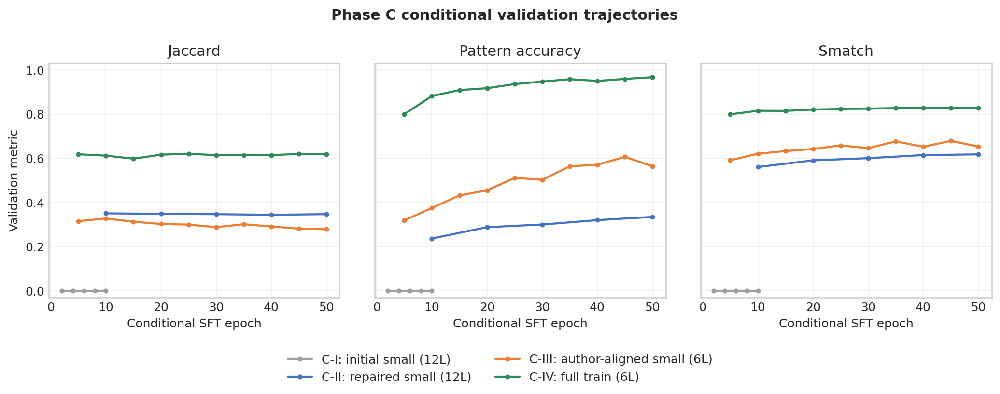
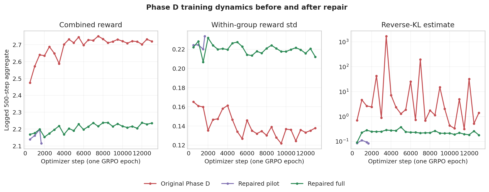
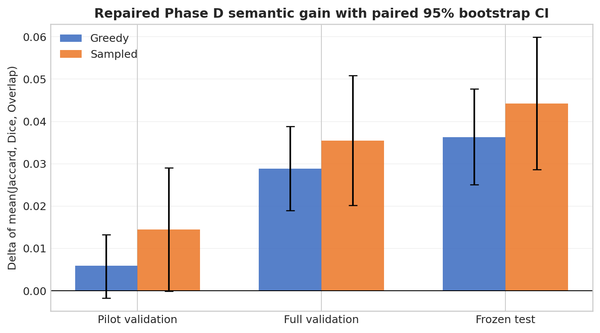
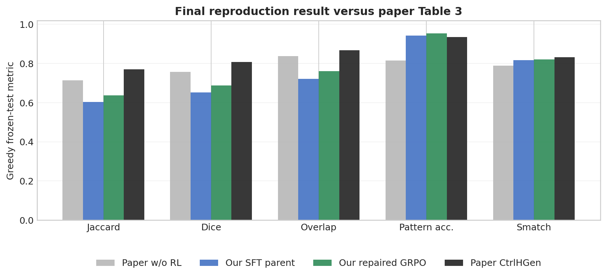

# CtrlHGen 综合复现报告：从监督契约修复到可控假设生成

> 报告日期：2026-08-12（Asia/Shanghai）
>
> 主任务：WN18RR + pattern condition，seed 42
>
> 最终模型：随机初始化 GPT-2，6 层、hidden size 768、12 heads
>
> 计算环境：单张 NVIDIA L20，Ubuntu 22.04，Python 3.11.11，PyTorch 2.6.0+cu124
>
> 证据范围：本地代码与论文、作者仓库 `upstream/main@3f658013`、DSW 持久盘原始记录

## 1. 摘要

本项目已经完成一条可审计的 CtrlHGen 复现链路：数据采样与去重、无条件 SFT、带逻辑条件的
conditional SFT、GRPO 强化学习、greedy/sampled 双解码 frozen-test，以及 checkpoint、tokenizer、
监督标签、运行配置和逐样本评测的一致性审计。我们没有使用论文中完整的 12 层训练方案作为
最终模型，而是采用了更小的 6 层 GPT-2；因此，本报告把结果定义为**方法与主要现象的高质量
复现**，不把它表述成论文绝对数值的逐点复刻。

复现经历了两个决定性的转折。第一，最初的零结果并不是“模型太小”或“训练轮数不够”这么
简单，而是 conditional 标签掩码和 tokenizer padding 状态共同破坏了监督契约。修复以后，
模型很快能够稳定生成可解析、有 EOS 的逻辑表达式。第二，在模型和训练动力学不变时，将每种
pattern 的训练样本从 1,024 扩到 8,000，使训练实体覆盖率从 35.41% 提高到 81.86%，greedy
Jaccard/Dice/Overlap 相对 small-v3 分别提高 0.3279/0.3454/0.3656。这是本项目中最清晰的
单变量结果，说明训练覆盖不足是小数据版本的主要瓶颈。

最终 repaired Phase D 使用 fresh RL-only 数据，并让 raw GRPO prompt 显式以 `SEP` 结束。
在唯一一次 1,664 条 frozen test 上，结果如下：

| decoding | Jaccard | Dice | Overlap | Pattern Accuracy | Smatch | Parse | EOS |
|---|---:|---:|---:|---:|---:|---:|---:|
| SFT parent, greedy | 0.60304 | 0.65173 | 0.72159 | 0.94291 | 0.81676 | 0.99159 | 1.00000 |
| repaired GRPO, greedy | **0.63667** | **0.68702** | **0.76142** | **0.95433** | **0.82006** | **0.99219** | **1.00000** |
| SFT parent, sampled | 0.55997 | 0.60575 | 0.67287 | 0.94351 | 0.81270 | 0.99038 | 1.00000 |
| repaired GRPO, sampled | **0.60490** | **0.65023** | **0.71625** | **0.95132** | **0.81681** | **0.99399** | **1.00000** |

repaired GRPO 相对配对 SFT parent 的 Jaccard/Dice/Overlap 三项均值，greedy 提高
`+0.03625`，95% paired bootstrap CI 为 `[0.02506, 0.04773]`；sampled 提高 `+0.04426`，
CI 为 `[0.02864, 0.05991]`。两种解码的区间都严格大于 0，且控制、parse、EOS 健康指标没有
退化。最终 greedy 相比论文 CtrlHGen 的 Jaccard/Dice/Overlap 仍低约
0.133/0.121/0.107，但 Pattern Accuracy 高 0.019，Smatch 低 0.013。换言之，我们已经较好
复现了“控制条件有效、RL 能继续改善集合语义”的主要现象，但更小模型在答案集合重合上仍有
明确差距。

## 2. 我们复现的任务与评价口径

CtrlHGen 面向知识图谱上的溯因推理：给定一组答案实体，模型生成一个可以解释这些答案的逻辑
查询假设；在可控版本中，还会给模型一个目标逻辑 pattern。整个训练流程可以概括为：

1. 从知识图谱采样 query–answer–pattern 监督记录，并生成只用于无条件阶段的 augmentation；
2. 无条件 SFT 学习逻辑表达式的语言、实体和关系分布；
3. conditional SFT 学习 `answers + condition -> hypothesis`；
4. GRPO 对同一 prompt 的多条 completion 做组内相对优化；
5. repaired GRPO 训练和终点选择期间不读取 test，冻结终点后各做一次 greedy 和 sampled test。

报告的五项论文指标是 Jaccard、Dice、Overlap、Pattern Accuracy 和 Smatch。前三项主要反映
生成假设执行后与目标答案集合的重合，Pattern Accuracy 衡量是否遵循指定逻辑结构，Smatch
衡量图结构相似。Parse、EOS 和 max-length rate 是生成健康指标，不应与语义指标混为一谈。

## 3. 论文、作者仓库与本复现的设置差异

公开材料之间并非完全自洽。论文当前版本写的是 12 层 GPT-2、AdamW、SFT LR `1e-5`、batch
256、400 轮 unconditional 和 50 轮 conditional；作者仓库则出现 `GPT2_6`、
`num_layers: 6`、LR `5e-5`、WN18RR batch 160 和 5-step warm-up 等线索。进一步执行语义
审计发现，作者公开代码中的 `num_layers` 并不会覆盖标准 GPT-2 的 `n_layer`，因此按当时
Transformers 行为仍会得到 12 层；conditional shell 又试图从 epoch 315 恢复，但总 epoch
配置为 50，逐行照跑会零步退出。

| 项目 | 论文正文 | 作者仓库表达的意图 | 公开代码当时的实际语义 | 本复现最终选择 |
|---|---|---|---|---|
| 实验范围 | 3 个 KG、无条件及 5 类控制条件 | README 主要给 WN18RR 示例 | 脚本与数据 profile 不完全一致 | WN18RR + pattern 单一切片 |
| 模型深度 | 12 层 | `GPT2_6` / `num_layers: 6` | 标准模板仍可能为 12 层 | 显式 `n_layer: 6` |
| hidden / heads | 未完整披露 | 依赖缺失的本地模型目录 | 注释指向 GPT-2 small | 768 / 12 |
| optimizer | AdamW | 配置未写 | 代码使用 Adam | Adam（SFT）；AdamW（GRPO） |
| SFT LR | `1e-5` | `5e-5` | `5e-5` | `5e-5` |
| batch | 256 | WN18RR 为 160 | 160 | 160 |
| SFT epochs | 400 + 50 | GPT-2 配置 50 | conditional 恢复逻辑可零步退出 | 50 + 50 |
| warm-up | 50 / 5 epoch | `warm_up: 5` | GPT-2 分支是前 5 optimizer step | 5 step，0.1×→1×，之后恒定 |
| train/pattern | 未充分披露 | full profile 为 8,000 | 依赖实际采样 | 8,000 |
| augmentation | 5 种复杂 pattern 分解 | `sample_add.py` allow-list 不同 | 未自动接入 README 主流程 | 论文 5 种 pattern，train-only |
| test | 论文聚合值 | 生成参数未完全披露 | 脚本分散 | 固定 1,664 条，双解码分开报告 |

因此，Phase C-II 是较接近论文训练规模表达的 12 层 small 基线；Phase C-III/C-IV 则是对
“作者仓库意图”的自洽实现：明确写入 6 层、Adam 和 5 optimizer-step scheduler，同时不复制
无效字段或零步退出。最终方案比论文模型更小，训练 epoch 也更少，但 full train 的样本规模与
作者仓库 profile 对齐。这个差异是解释绝对指标差距时必须保留的边界。

计算资源也不等价：论文报告使用 4 张 NVIDIA A6000，而我们的完整链路运行在单张 L20。RL
公开脚本同样存在两套不一致表达：multi 脚本使用 4 进程、batch 16、8 epoch、reward 权重
`[1, 0.5, 0.5, 1]`、beta 0.1；单 GPU 脚本则使用 batch 32、1 epoch、权重
`[1, 1, 0.5, 0]`、beta 0.05。我们的冻结方案采用 group 4、batch 32、1 epoch，同时采用
`[1, 0.5, 0.5, 1]`、beta 0.1、epsilon 0.2，并显式固定所有会受 TRL 版本默认值影响的参数。
repaired Phase D 的 fresh RL-only 数据和末尾 `SEP` 是根据实证诊断做出的明确方法修复，属于
对作者公开流程的有据偏离，不能倒写成原仓库已经提供的设置。

## 4. 复现基础设施与早期修复

Phase A/B 主要完成了看似琐碎、实际决定实验是否可信的基础工作：

- 固定 seed、采样 manifest、KG/data/config semantic hash 和精确 Git SHA；
- 将数据、checkpoint、运行日志和缓存放到 DSW 仓库外的持久路径；
- 让 checkpoint 严格保存并校验模型配置、tokenizer、训练状态和生成健康状态；
- conditional active labels 精确等于 `target + END`，prompt 部分全部 mask；
- 训练固定 right padding，生成只在受控作用域临时切到 left padding，并同步清理 tokenizer
  backend 状态；
- 只有 parse/EOS 通过健康门槛的 checkpoint 才能进入下一阶段；
- greedy/sampled 输出分开命名，逐样本 JSONL 可独立重算 aggregate CSV。

这些修复使“脚本执行结束”和“实验有效完成”成为两个不同概念。后续所有正式实验均检查非有限
loss、optimizer step、LR 轨迹、checkpoint 新进程加载、record 唯一性和 test 泄漏。

## 5. Phase C：四轮 SFT 的演进

### 5.1 四轮实验概览

| 阶段 | 主要设置/变更 | 结果与作用 |
|---|---|---|
| C-I 初始 small | 12 层，20+10 epoch，LR `1e-5`；旧 conditional contract | test 五项全 0；暴露 padding/label-mask 故障，checkpoint 禁止复用 |
| C-II repaired small | 修复 contract；12 层，实际 311+50，AdamW，small train | 能稳定 parse/EOS；greedy Jaccard 0.3299、PA 0.3185 |
| C-III author-aligned small | 6 层，Adam，LR `5e-5`，batch 160，50+50 | PA/Smatch 明显提高，但 J/D/O 下降，显示控制与集合语义并非同一维度 |
| C-IV author-scale full | 仅把 train/pattern 从 1,024 扩到 8,000 | 五项全面跃升；确认实体监督覆盖是 small 版本的主要瓶颈 |



**图 1：四轮 Phase C 的训练 loss。** 图使用 DSW 原始逐 epoch history。不同轮中只有
C-III→C-IV 是以训练规模为主要变量的受控比较；C-I conditional 的 loss 下降不能当作学习
成功，因为 target 和 `END` 当时被错误 mask。

### 5.2 C-I：零结果如何帮助定位真实故障

C-I 使用 12×768×12 模型，unconditional 20 epoch、conditional 10 epoch。unconditional
parse 从接近 0 缓慢升到 epoch 20 的 0.1196，说明预算结束时模型刚开始形成语法；conditional
train loss 从 5.703 降到 4.888，但所有验证指标和 test 都是 0。随后真实数据 overfit 诊断
发现，即使旧契约下 loss 能降到约 0.006，仍然是 0 EOS/0 parse。原因是 validation generation
改变 fast tokenizer 的 padding 后，backend 状态被带入 checkpoint；conditional pair mask
因此错位，target 与 `END` 均未参与监督。

所以 C-I 同时存在预算不足和实现错误，不能只用一个原因解释。它的价值是建立了后来所有
label、padding、EOS 和 checkpoint round-trip 回归测试。

### 5.3 C-II：语法健康不等于语义复现

C-II 修复监督链路后，12 层 unconditional 配置 400 epoch，按预先记录的成本与 plateau 规则
在 epoch 311 后停止；conditional 完成 50 epoch。unconditional train loss 从 epoch 10 的
5.411 降至 epoch 310 的 0.125，但 validation loss 在约 epoch 40 后总体上升；与此同时，
parse 和 Jaccard 仍持续改善并在后期波动。conditional 也呈现 train loss 下降、validation
loss 缓慢上升、Pattern Accuracy 继续增长而 Jaccard 近似横盘的特征。

这说明 teacher-forced token NLL、自由生成语法健康、答案集合重合和条件遵循是不同目标。
只按 validation loss early-stop 会过早丢掉仍在成熟的生成能力，反过来只看 parse 也不能保证
语义正确。C-II greedy test 为 0.3299/0.3656/0.4244/0.3185/0.6028，已经不再是实现坏掉的
零结果，但离论文 SFT-only 仍很远。

### 5.4 C-III：作者意图版改善控制、牺牲集合重合

C-III 同时将 12 层改为 6 层、AdamW 改为 Adam、LR 提高到 `5e-5`、batch 改为 160，并采用
5-step warm-up 后恒定的 50+50 训练。正式实验前，隔离 10+10 pilot 的 7 项 gate 全部通过；
正式模型从新随机初始化开始，不复用 pilot 或 C-II 权重。

v3 greedy 相对 v2，Pattern Accuracy 从 0.3185 升到 0.5883，Smatch 从 0.6028 升到
0.6613，但 Jaccard 从 0.3299 降到 0.2690，Dice/Overlap 也同向下降。比较支持一个重要观察：
模型更会生成指定的逻辑形状，并不保证其中的实体/关系实例化能命中目标答案集合。由于这一轮
同时改变多个因素，我们不把现象单独归因于模型深度、optimizer 或 LR。



**图 2：conditional validation 轨迹。** C-I 是无效监督下的零线；C-II 的 Jaccard 近似
横盘而 Pattern Accuracy 缓慢上升；C-III 明显强化控制；C-IV 在保持 v3 动力学时形成整体跃升。

### 5.5 C-IV：训练覆盖是最清晰的单变量证据

C-IV 固定 v3 的模型、optimizer、LR、scheduler、batch、seed、augmentation、50+50 epoch、
validation/test 和 primary selection，只将 base train 从 13×1,024 扩到 13×8,000。预检曾
发现一条 train–test 完整监督 tuple 重合，实验在训练前停止；修复策略冻结 test、再冻结 valid，
只重采样冲突 train。最终完整监督 tuple 跨 split 重合为 0，valid/test 与 v3 字节完全相同。

| 覆盖统计 | v3 small | C-IV full | 变化 |
|---|---:|---:|---:|
| base train | 13,312 | 104,000 | 7.81× |
| unconditional merged train | 26,257 | 204,610 | 7.79× |
| train entity vocabulary coverage | 35.41% | 81.86% | +46.45 pp |
| valid unseen entity occurrence | 28.25% | 3.03% | -25.21 pp |
| test unseen entity occurrence | 27.70% | 3.34% | -24.37 pp |
| relation coverage | 22/22 | 22/22 | 不变 |

正式 50+50 训练从 2026-08-10 23:42 到次日 03:47，约 4 小时 5 分；unconditional/conditional
峰值显存约 24,835/30,051 MiB。训练规则选出的 conditional epoch 50 frozen test，greedy
为 0.5969/0.6447/0.7149/0.9441/0.8196。相对 v3 五项全部提高；相对论文 w/o RL，
Jaccard/Dice/Overlap 仍低 0.1181/0.1133/0.1221，但 Pattern Accuracy 和 Smatch 已高
0.1291/0.0296。

由于关系在 small 数据中已经全覆盖，而实体覆盖和测试 unseen occurrence 在扩容后发生巨大
变化，集合指标跃升最直接的解释是模型终于见到了足够多的实体监督。这不证明覆盖是唯一瓶颈；
`pin`、`inp`、union sampled 和长结构仍明显较弱，而且目前只有 seed 42。

### 5.6 Phase D parent：训练选点与研究目标选点分离

原字典序训练规则因 Pattern Accuracy 更高而选择 epoch 50。随后为“优先缩小论文集合指标
差距”的明确目标，对仍保留的 epoch 45 做隔离 bake-off：epoch 45 在 greedy 和 sampled 的
Jaccard/Dice/Overlap、五项均值上都略高，代价是 Pattern Accuracy、Smatch、parse 小幅下降，
所有健康门槛仍通过。差异的 bootstrap 区间跨 0，所以这只是透明的工程选择，不是显著性结论。

最终保留两个不同语义的指针：`conditional-best -> epoch-50` 记录原训练选择，
`phase-d-parent -> epoch-45` 记录 GRPO parent。任何报告都不应把两者混写。

这里还有一个重要评估限制：epoch 45/50 bake-off 使用了后来 repaired frozen-test 所在的同一
test split。因而 test 对“从 SFT parent 选择到最终 GRPO”的完整流水线已不是完全 untouched
holdout。后续 GRPO 没有根据 test 选择 checkpoint，且 parent 与 candidate 在同一记录上的
paired 改善仍可解释；但与论文绝对数值做无偏对照时必须更谨慎。

## 6. Phase D：从小幅增益到 repaired GRPO

### 6.1 原 Phase D：有效运行，但方法契约仍有缺口

原 Phase D 从 C-IV epoch 45 出发，使用 104,000 条 conditional SFT base train 做 1 epoch、
13,000 optimizer steps 的 GRPO：group 4、batch 32、LR `1e-5`、beta 0.1、epsilon 0.2，
reward 为 `Jaccard + 0.5*Dice + 0.5*Overlap + condition`。

训练在 step 3500 出现聚合 KL 1703.28。按门槛在 step 4007 保留现场并停止；审计确认模型、
optimizer、checkpoint 张量均有限，step 4000 KL 已回落到 7.19，因此从完整 checkpoint-4000
显式 resume，最终正常完成 step 13000。旧 terminal 在 test 上相对 SFT parent 的三项均值，
greedy/sampled 分别提高 0.00993/0.01112，按当时预注册 gate 有效通过。

这批结果在自身冻结协议下是有效记录，但后来审计发现两处方法忠实度问题：raw GRPO prompt
没有显式以 target-boundary `SEP` 结束；同时 GRPO 再次使用 conditional SFT 已训练 50 epoch
的数据，组内 completion 很容易获得相同 reward，relative advantage 信号稀疏。因此旧结果
应作为诊断基线保留，而不是最终方法结果。



**图 3：原始与 repaired Phase D 的训练动力学。** 三轮都只有一个 GRPO epoch，所以横轴用
optimizer step。原流程 reward 较高，主要因为 prompt 来自已经高度拟合的 SFT train；其
reward std 较低且 reverse-KL 出现多个数量级尖峰。fresh data + SEP 后 reward 绝对值较低，
但组内方差更充足、KL 稳定在约 0.09–0.38。

### 6.2 Repaired pilot：恢复正确 prompt 和未见 RL 数据

repaired pilot 保持同一个 6 层 parent、optimizer、reward 和 group size，只联合修复两点：

1. raw generation prefix 明确变为 `answers COND pattern SEP`；
2. 从 train graph 新采样 13×1,024 条 RL-only 数据，与 merged SFT train 和 validation 按
   query+pattern 严格去重，不读取 test。

step 0 的 256 个 prompt group/1,024 条 completion 审计显示：zero reward-variance group
rate 为 63.67%，mean unique strings/group 为 2.238，parse 0.9971、EOS 1.0，达到启动 gate。
虽然信号仍然稀疏，但不再是训练入口完全没有信息。1,664-step pilot 的 validation 三项均值
greedy 提高 0.00590，sampled 提高 0.01446；两者 CI 下界仍略跨 0，所以结论仅是“修复方向
有希望”，不能写成已显著改善。

### 6.3 Repaired full：稳定的 13,000-step 确认实验

full repaired run 新采样 104,000 条 fresh RL-only 记录，并额外排除 pilot query；内部重复和
与 SFT train、validation、pilot 的重合均为 0。step 0 零 reward 方差组为 60.55%。训练用时
4,094.9 秒，无 OOM、NaN、中断或旧流程的极端 KL 聚合离群；500-step KL 位于
`[0.0904, 0.3780]`。固定 validation probes 在 step 6,800、10,600、13,000 的 greedy 三项
均值增益分别为 0.02631/0.02445/0.02884，始终高于继续门槛；terminal paired CI 为
`[0.01897, 0.03885]`。sampled terminal 增益 0.03547，CI `[0.02017, 0.05091]`。



**图 4：repaired Phase D 从 pilot 到 full validation、再到唯一 frozen test 的三项均值增益。**
误差线为逐样本 paired bootstrap 95% CI。pilot 只说明方向；full validation 和 frozen test 的
greedy/sampled 区间均严格大于 0。

### 6.4 唯一一次 repaired frozen-test

test 前冻结 checkpoint-13000、terminal model SHA、1,664 条 split、双解码和通过规则；入口
还要求 output 不存在、trainer global step 恰为 13,000。评测后禁止继续训练或选择其他
checkpoint。最终 repaired terminal 相对 SFT parent 的五项指标全部同向改善，parse/EOS/PA
健康门槛全部通过；相对旧 Phase D terminal，greedy/sampled 三项均值又提高
0.02632/0.03793，paired CI 分别为 `[0.01418, 0.03870]` 和 `[0.02114, 0.05478]`。

这一证据支持：原 Phase D 低增益的首要原因是复用高度拟合的 SFT train 造成组内 advantage
稀疏，以及 raw prompt 缺少 `SEP` 造成训练–评估前缀错位。它同时否定了“6 层模型太浅，所以
GRPO 根本训不动”作为主要解释；模型容量仍可能限制最终绝对上限，但不是本轮 RL 信号问题。
这里的“唯一一次”专指 repaired checkpoint 的最终双解码评测，不表示该 split 在此前 parent
bake-off 中从未被访问。

## 7. 最终结果与论文对照



**图 5：最终 greedy frozen-test 与论文 Table 3 的尺度对照。** 论文值来自不同且未完全披露的
设置，不能当作严格同分布显著性比较。

| 设置（greedy） | Jaccard | Dice | Overlap | Pattern Accuracy | Smatch | 五项均值 |
|---|---:|---:|---:|---:|---:|---:|
| 论文 CtrlHG w/o RL | 0.715 | 0.758 | 0.837 | 0.815 | 0.790 | 0.7830 |
| 我们的 C-IV SFT parent | 0.60304 | 0.65173 | 0.72159 | 0.94291 | 0.81676 | 0.74721 |
| 我们的 repaired GRPO | **0.63667** | **0.68702** | **0.76142** | **0.95433** | **0.82006** | **0.77190** |
| 论文 CtrlHGen | 0.770 | 0.808 | 0.868 | 0.935 | 0.833 | 0.8428 |

我们的 SFT/GRPO 在 Pattern Accuracy 上都超过论文对应参照，Smatch 接近论文；主要差距集中在
Jaccard、Dice、Overlap。这个形态与 Phase C 的覆盖分析、sampled 比 greedy 更容易损伤集合
指标、`pin/inp` 等复杂 pattern 偏弱是一致的。一个合理但仍需消融验证的解释是：6 层容量、
更少 SFT epoch、未公开的论文采样/seed/生成参数，以及复杂实体组合的建模能力共同限制了集合
语义上限。报告不能把剩余差距全部归于模型更小，也不能把 PA 超过论文解释成全面优于论文。

## 8. 如何理解目前曲线与指标特征

1. **loss 与生成指标背离是目标差异，不必自动判为训练失败。** teacher-forced NLL 衡量已知
   前缀上的 token 概率；parse、集合执行结果和 pattern adherence 来自自由生成。C-II 中
   validation loss 上升而 Jaccard/parse 仍改善，正是两类目标不一致的表现。
2. **控制结构与答案集合是两个维度。** C-III PA/Smatch 上升但 J/D/O 下降，说明模型可以学会
   “长得像指定 pattern”，却没有学好实体/关系实例化。C-IV 的更多实体监督才让两类指标同时上升。
3. **sampled 的 PA 接近 greedy，但集合指标更低。** 这符合“随机采样不一定改变粗粒度逻辑形状，
   却更容易扰动具体实体、关系 token 和执行答案”的解释；目前是由指标形态支持的推断，不是独立
   因果实验。
4. **旧 Phase D 的高 reward 不代表更好的 RL 信号。** 它在已见 SFT prompt 上获得更高绝对 reward，
   但组内标准差更低；GRPO 依赖组内排序，fresh 数据较低的绝对 reward 反而提供了更有效的 advantage。
5. **极端 KL 不等于 checkpoint 已数值发散。** 旧流程的 TRL 0.16 reverse-KL 指数估计会被少数
   大但有限的 log-prob gap 支配。停止、检查参数与 optimizer 有限性、观察下一窗口回落后再显式
   resume，比删除现场或直接调 beta 更符合本轮审计目标。

## 9. 证据强度、局限与允许的结论

可以较强地说：

- 初始 conditional 零结果有确定的 padding/label-mask 实现原因；
- 在 C-III→C-IV 的受控比较中，扩大训练规模显著改变实体覆盖，并大幅改善全部五项指标；
- fresh RL-only + `SEP` 的 repaired Phase D 在 validation 和唯一 test 上都稳定提高集合三指标，
  且没有损害控制与生成健康；
- 6 层容量不是旧 Phase D 低增益的主要原因。

不能据此说：

- 已严格复现论文绝对数值；
- 单 seed 的全部 SFT 差异具有统计显著性；
- C-III 的变化可归因于某一个超参数；
- fresh data 与 `SEP` 两项修复各自贡献了多少；
- Pattern Accuracy 超过论文就代表整体性能超过论文。

另外，paired bootstrap CI 描述的是固定模型、固定 1,664 条记录上的逐样本不确定性，不等于
跨训练 seed 的显著性；论文表中 `±` 的 seed/run 数又未披露，两者不能直接对比。由于 parent
曾通过同一 test 做 bake-off，这些 CI 也应理解为**条件于当前 parent 和 test 的配对改善**，
而不是完整模型选择流程的无偏泛化区间。

后续如果目标是继续逼近论文绝对指标，最有信息量的实验不是继续调 repaired 6-layer terminal，
而是独立开展 12 层 depth-only Phase C-V，并对 fresh RL 数据做多 seed replicate。12 层实验必须
作为新的容量/论文忠实度消融，不能利用本次 frozen-test 继续选点后仍声称同一个 test 冻结协议。

## 10. 可复核材料与重建方法

报告使用的 compact 原始记录已从 DSW 按字节复制到
`worklogs/reproduction/report-data/`：四轮 Phase C 的
unconditional/conditional history、原 Phase D 和 repaired pilot/full 的 trainer state、
中断诊断、validation comparison 与 frozen-test aggregate。`sha256sums.txt` 可确认本地副本；
大 checkpoint、完整 stdout 和逐样本 JSONL 仍保留在 DSW 的 `/mnt/workspace/ctrlhgen-*`。

从仓库根目录重建五张图：

```bash
MPLCONFIGDIR=/tmp/ctrlhgen-mpl \
  python3 scripts/plot_reproduction_metrics.py
```

主要远端证据目录：

```text
/mnt/workspace/ctrlhgen-runs/repro-wn-pattern-phase-c-seed42-20260809-111557/
/mnt/workspace/ctrlhgen-runs/repro-wn-pattern-small-v2/
/mnt/workspace/ctrlhgen-runs/repro-wn-pattern-small-author-aligned-v3/
/mnt/workspace/ctrlhgen-runs/repro-wn-pattern-full-train-author-aligned-c4/
/mnt/workspace/ctrlhgen-runs/phase-d-formal-20260811-epoch45/
/mnt/workspace/ctrlhgen-runs/phase-d-repaired-pilot-20260811/
/mnt/workspace/ctrlhgen-runs/phase-d-repaired-full-20260811/
/mnt/workspace/ctrlhgen-runs/phase-d-repaired-frozen-test-20260812/
```

详细逐轮命令、Git SHA、config/data/KG hash、artifact SHA 和异常恢复记录，分别保存在：

- `worklogs/reproduction/phases/phase-c-2026-08-10.md`
- `worklogs/reproduction/phases/phase-d-2026-08-11.md`
- `worklogs/reproduction/phases/phase-d-pilot-2026-08-11.md`
- `worklogs/reproduction/phases/phase-d-repaired-full-2026-08-11.md`
- `worklogs/reproduction/phases/phase-d-repaired-frozen-test-2026-08-12.md`

## 11. 结论

这次复现最重要的成果，不只是得到一组最终数字，而是把“为什么零结果”“为什么 small 模型
看似学会结构却答不准”“为什么旧 RL 只有小幅收益”逐层拆成了可验证的问题。项目从一个会执行
完、但 conditional 监督实际上无效的脚本，发展为一条对数据覆盖、prompt boundary、checkpoint、
测试隔离、曲线和逐样本评测都有明确契约的实验流水线。

最终 6 层 repaired CtrlHGen 在 greedy test 上达到 Jaccard 0.6367、Dice 0.6870、Overlap
0.7614、Pattern Accuracy 0.9543、Smatch 0.8201；在 sampled 下也获得一致的 paired 增益。
它尚未达到论文的答案集合三指标，但已经复现了可控逻辑生成与 GRPO 改善语义的核心现象，并
通过 C-IV 清楚指出：在当前规模和设置下，训练实体覆盖比“是否能生成合法结构”更早成为主要
瓶颈。这为下一步多 seed 验证和 12 层容量消融提供了可信、可复核的起点。
